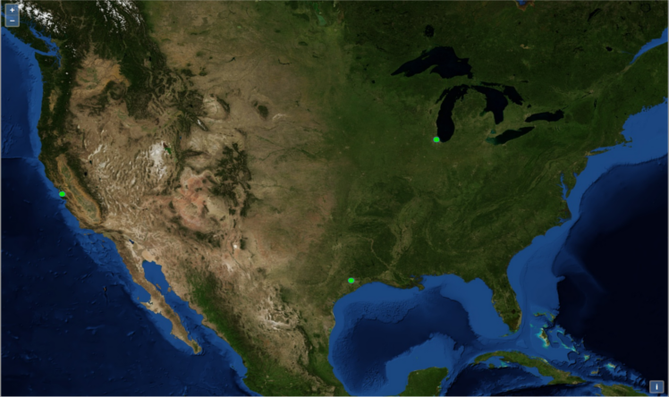

To understand this tutorial, understanding how to create & connect an IWC client
is necessary, as well as an understanding of the Data & Intents API. Advanced
references are used in this application to aid in references that collect.

**This application/tutorial is used to complement the Location Lister**. A majority of
terms in this tutorial are defined in the
[Location Lister](30_locationLister.html) tutorial. Refer to that tutorial prior
to this one.

The full application source can be found [here](https://github.com/ozone-development/ozp-demo/tree/master/app/locationViewer). This application was built
using JQuery and Open Layers.

***

# Location Viewer

The Location Viewer application has no direct user input. Rather it
registers an intent to allow other applications to drive the Location Viewer
to plot desired `Locations`.


The Location Viewer is one of the example apps hosted on the [homepage]({{site.baseurl}}/)
of the IWC website.

Since there is limited functionality in this application, the `Intent` class
created in Location Lister wasn't used in this application.

# Inbound Intent: /json/coord/map
```js
//=======================================
// Location Mapping shared functionality:
//      Registers Intent for /json/coord/map
//
//
// IWC References:
// API: Intents
// Resource: /json/coord/map
//=======================================
var mappingRef = new iwc.intents.Reference("/json/coord/map");

var metaData = {
  icon: "http://some.website.io/iconPath.png",
  label: "Location Viewer"
};

// This function expects to receive a data.api resource name to be used.
var mapFn = function(resource) {
  if (!locations[resource]) {
    locations[resource] = new Location({
      map: map,
      resource: resource
    });
  }
};

mappingRef.register(metaData, mapFn);
```
The `mapFn` function registered to the `/json/coord/map` intent expects a
**string** resource path as its input. This allows the creation of a `Location`
object which refers to the Data API resource.

The `Location` class in the Location Viewer takes an additional property `map`,
which is a reference to the Open Layers map used in this application.

***

# Location class
```js
//=======================================
// Location: Contains IWC reference and map functionality
//
// IWC References:
// API: Data
// Resource: *
//=======================================
var Location = function(config) {
  this.resource = config.resource;
  this.reference = new iwc.data.Reference(config.resource);
  this.map = config.map;

  var self = this;
  var onChange = function(changes) {
    self.map.updateMarker(self.resource, changes.newValue);
  };

  this.reference.watch(onChange).then(function(location) {
    self.map.addMarker(location, self.resource);
  });
};
```

Much like the `Location` class created for Location Lister, this class watches
the Data API resource it creates a **reference** to to track updates and will
update its marker on the graph should the value change. Additionally, if the
resource is deleted, the `updateMarker` functionality knows to remove the
marker if it receives `undefined` as its updated value.
